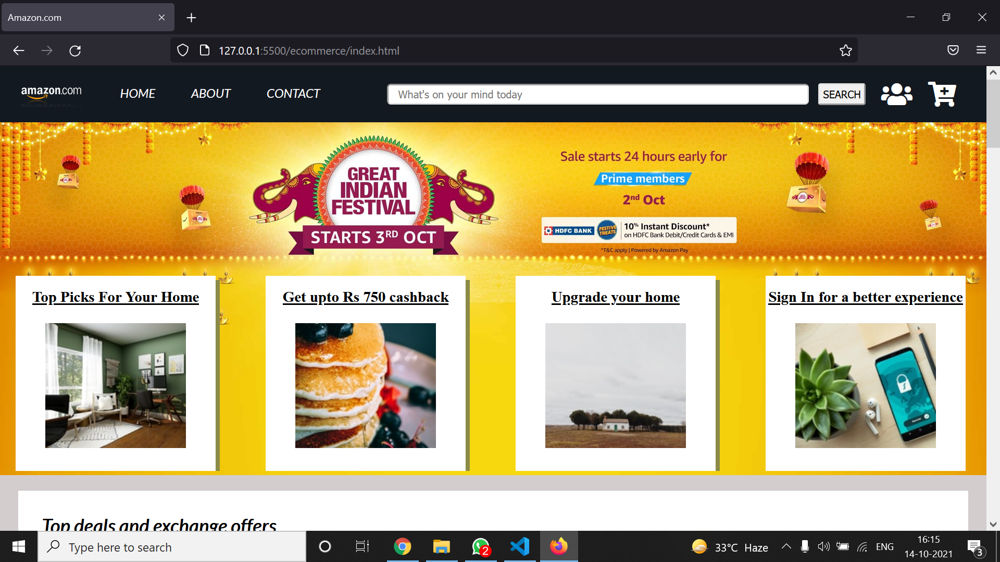
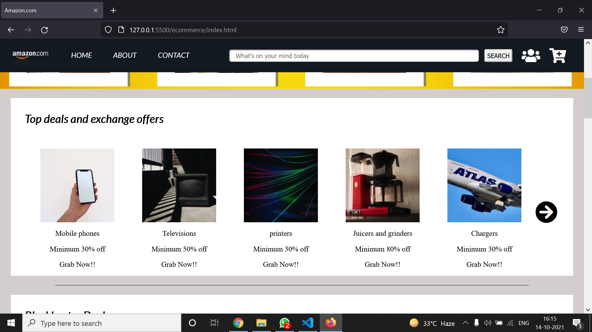
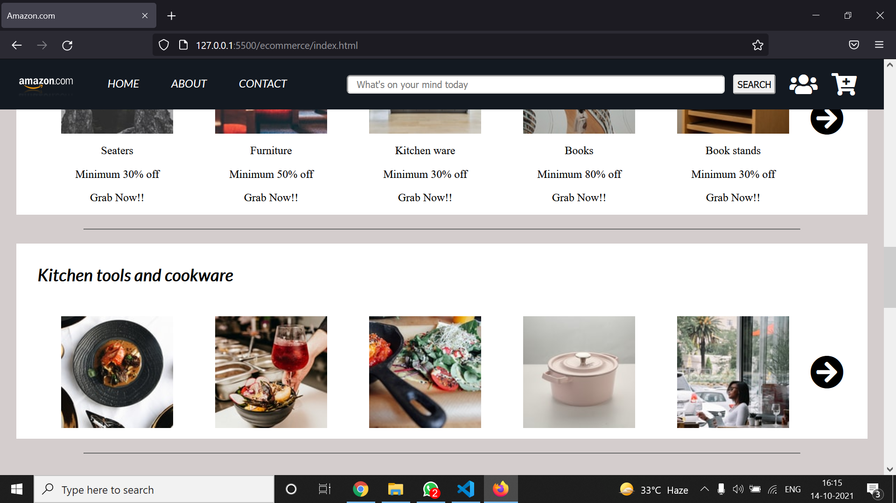
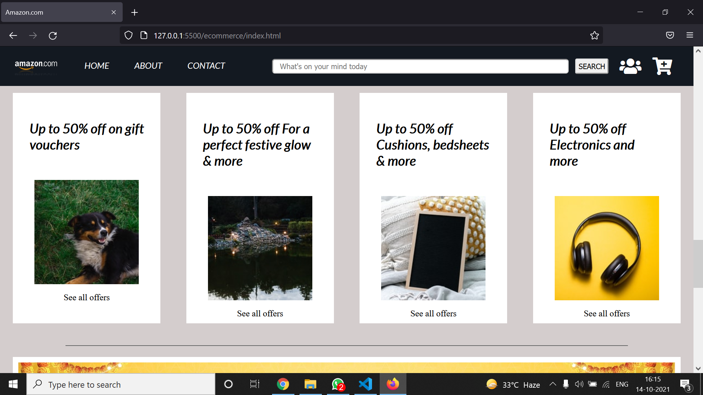

  <h1>Amazon UI clone</h1>
   
  This is a sample Amazon UI clone

  
   
  

Table of Contents

  
- [About](#about)
- [Tech Stack used](#tech-stack-used)
- [Tutorial](#tutorial)
- [Contributors](#contributors)
  

## 📝About
<table>
  <tr>
    <td>
      •	This is a sample UI for amazon.  
      •	It is under no copyright infringement.  
    </td>
  </tr>
</table>

## 🤖Tech-Stack used

## 📝Tutorial
The landing Page 
</img>

  
</img>

  
</img>

  
</img>

  
</img>

## 👩‍💻Contributors
- [Rushabh Maru](https://github.com/RushabhM03)
 
 
 STILL UNDER CONSTRUCTION
